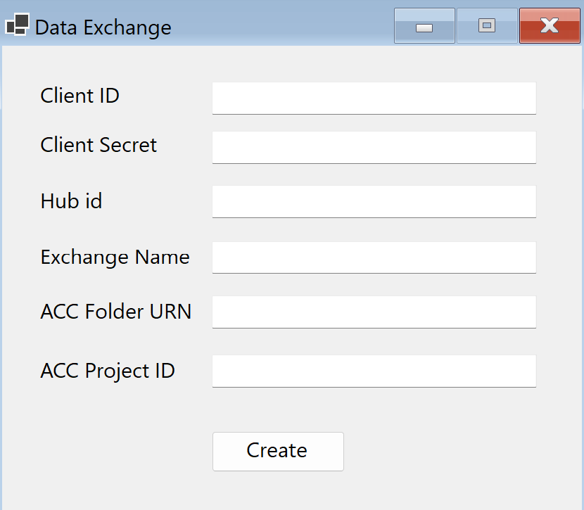

# THIS IS A WORk ON PROGRESS

# aps-dx-sdk-test

Sample Form to create Exchanges using a sample geometry file as input

## How it works

You just need to paste your data in the form and then click on create.

Sample format:

- Client ID: `Gf9s8m...Ym27PoJq` 
- Client Secret: `B8jFFuy40X...ApI1tFEwB5`
- Hub ID: `b.238cb7ac-...-b99f6f87ecdf`
- Exchange Name: `Sample Exchange Name`
- ACC Folder URN: `urn:adsk.wipprod:fs.folder:co.D...Pd-R7...8OA`
- ACC Project ID: `b.f8399885-...-83927ebbd987`

Your Exchange will be created in the selected folder with the name you specified.

You can use the [Sample column IFC file](./aps-dx-sdk-form/column.ifc) file for Exchange creation.